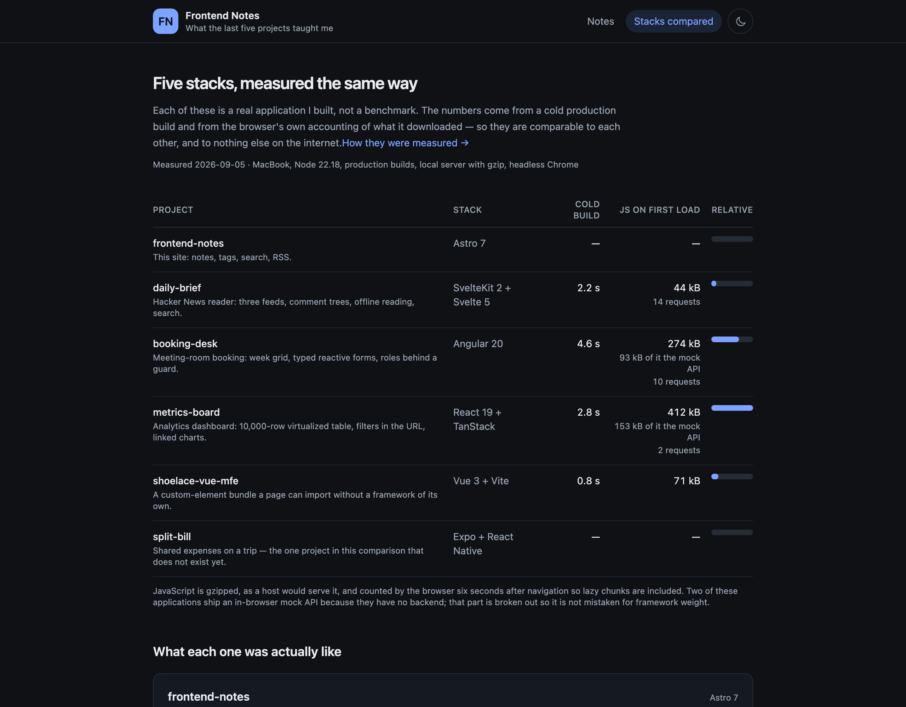

# Frontend Notes

Notes from building five small products on five stacks I had not used before —
and a comparison page that puts a measured number next to each of them.



## What it is

- **Seven notes**, each one from a specific bug in a specific project: a service
  worker URL that broke every shared link, sticky headers that slide the wrong
  way inside a horizontal scroller, a lazy landing route that cost 0.37 of
  Cumulative Layout Shift, a grid with 120 tab stops, and a contrast failure
  that every button in a design system inherited.
- **A stack comparison** with cold build times and the JavaScript each project
  actually hands the browser — measured on one laptop, on one afternoon, all the
  same way.
- **Search across the full text**, tags, an RSS feed, a sitemap, and a generated
  preview image per note.

## How much JavaScript this site ships

Zero, on every page, as counted by the browser:

| Page | JS requests | JS bytes |
|---|---|---|
| Home, a note, a tag page, the comparison | 0 | 0 |
| The notes index, after you type in the search box | 1 | 46 kB (Pagefind) |

The two scripts on a page are inlined in the HTML and add up to a few hundred
bytes: one sets the theme class before the first paint, one handles the toggle.
Nothing else is shipped, because nothing else needs to run — the pages are
rendered at build time and the only interactive thing on the site is the search
box, whose engine is fetched on the first keystroke and never before.

That is the entire argument for this stack, and it is the reason the number is
in the table rather than in a sentence: for a site that is mostly prose,
everything else in the comparison ships between 44 kB and 412 kB before it can
draw anything.

## The stack

| | |
|---|---|
| Framework | Astro 7 — static output, no adapter |
| Content | Content collections with a Zod schema, Markdown and MDX |
| Styling | Tailwind 4 with a token layer, light and dark |
| Search | Pagefind, indexed from the rendered HTML at build time |
| Images | `satori` + `resvg` generating an Open Graph card per note |
| Tests | Vitest — the front matter, the comparison data, and the built site |

## What is worth looking at

- **The schema is the contract.** `src/content/schema.ts` is a plain Zod object
  imported by both the collection config and the tests, so a note missing a
  description fails the build with the file name and the field, rather than
  disappearing quietly from a list.
- **Drafts live in the open.** A note with `draft: true` renders on the dev
  server and never reaches a production build — no branch, no folder of things
  someone forgot about. A test asserts it stays out of the built site and the
  feed.
- **Search is the only island, and it is lazy.** The runtime is imported on the
  first keystroke. It also has to be loaded past the bundler: even with a
  runtime path and a `@vite-ignore` comment, the build rewrote the dynamic
  import into its preload helper and left `__VITE_PRELOAD__` unsubstituted in
  the inlined script, so the import threw at runtime. The workaround, and the
  reason for it, are commented where they live.
- **The numbers are reproducible.** `/notes/measuring-instead-of-guessing`
  describes the method: delete every cache, time the build, serve the output
  over a gzipping local server, and let headless Chrome count what it
  downloaded.

## Running it

```bash
npm install
npm run dev        # http://localhost:4321
```

```bash
npm run lint       # astro check
npm run build      # astro build + pagefind index
npm test           # 33 tests
```

Node 22. Search only works against a production build, because the index is
generated from the rendered pages — the dev server says so instead of failing
silently.

## Tests

Thirty-three of them, in three layers:

- **Front matter** — every note validates against the same schema the build
  uses, drafts are allowed to be stubs and published notes are not, and no two
  tag spellings collapse into one page.
- **Comparison data** — every row has a repository and a description, a row is
  either fully measured or openly marked as a gap, and a mock-API figure can
  never exceed the bundle it is part of.
- **The built site** — no `<script src>` on a note page, no draft in the output
  or the feed, a preview image and a canonical link for every note, a search
  index, a sitemap and a 404 page.

CI runs lint → build → test, in that order, because the last group asserts on
the built output.

## Deploy

`netlify.toml` is committed: build command, publish directory, immutable caching
for hashed assets and preview images, and no caching for the search index, which
is regenerated on every build.

```bash
npx netlify deploy --prod
```

There is no public link yet — the repository is private. Lighthouse on the local
production build reports **100 / 100 / 100 / 100** (performance, accessibility,
best practices, SEO) on both the home page and a note page, with CLS 0.

## Known limits

- Static output only: no server, no comments, no analytics.
- Pagefind indexes the built HTML, so search reflects the last build rather than
  the working tree.
- The comparison covers what has been built. One project in the table has no
  numbers because it does not exist yet, and it says so rather than being
  quietly dropped.
